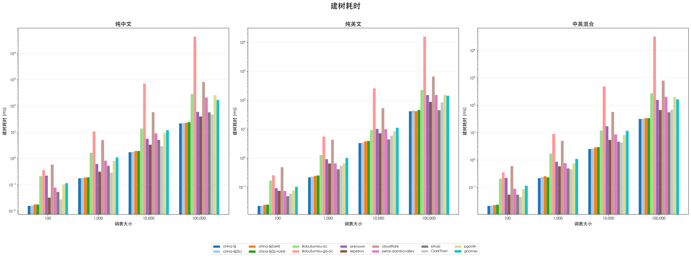
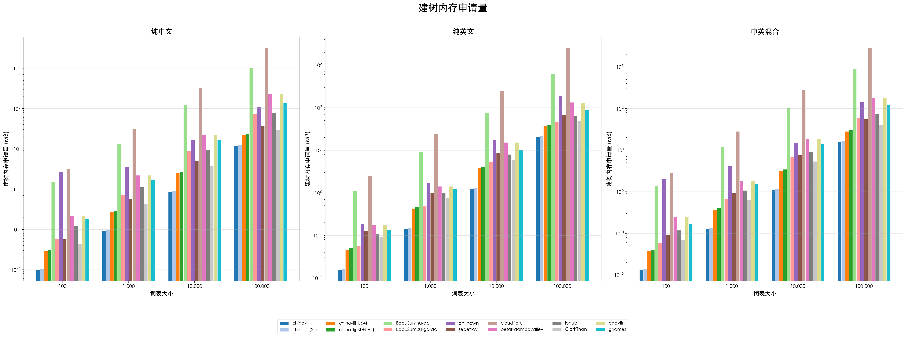
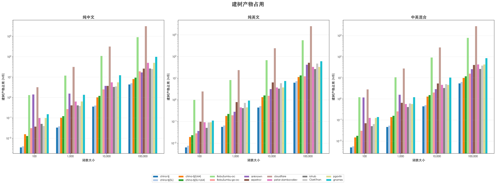
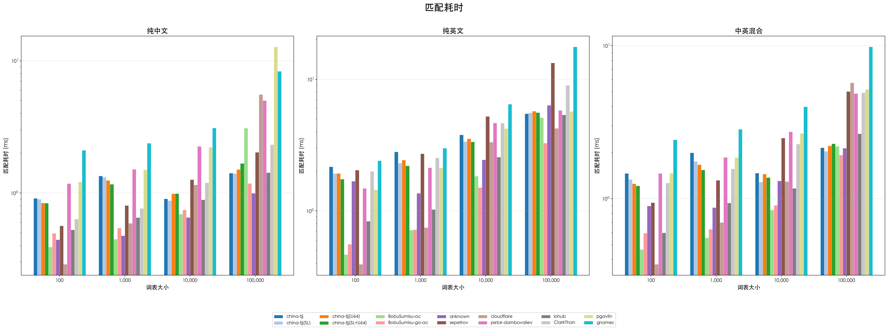

# AC 自动机 Benchmark 结果

## 简介

本项目对多个 Go 语言 Aho-Corasick（AC 自动机）开源库进行性能基准测试，对比维度包括 **建树耗时**、**建树内存申请量**、**建树产物内存占用**、**匹配耗时**。

测试词表覆盖 100 / 1,000 / 10,000 / 100,000 四种规模，语言类型涵盖纯中文、纯英文、中英混合（各 50%），词表由代码随机构造并模拟真实概率分布。

### 对比库

| 库 | Benchmark 名 | 说明 |
|---|---|---|
| [china-tjj/acautomaton](https://github.com/china-tjj/acautomaton) | china-tjj | 紧凑 Trie，三级索引（线性/二分/哈希），自动选择最小 uint 类型 |
| 同上 | china-tjj(SL) | 同上 + 构建后缀链接（加速匹配，额外 O(N) 空间） |
| 同上 | china-tjj(U64) | 同上，手动指定 uint64 索引（与其他库同一维度对比） |
| 同上 | china-tjj(SL+U64) | 后缀链接 + uint64 索引 |
| [BobuSumisu/aho-corasick](https://github.com/BobuSumisu/aho-corasick) | BobuSumisu-ac | DFA 矩阵实现，构建快，int 索引 |
| [BobuSumisu/go-ahocorasick](https://github.com/BobuSumisu/go-ahocorasick) | BobuSumisu-go-ac | 双数组 Trie，作者旧版实现 |
| [anknown/ahocorasick](https://github.com/anknown/ahocorasick) | anknown | 双数组 Trie，int 索引，内存占用低 |
| [sepetrov/ahocorasick](https://github.com/sepetrov/ahocorasick) | sepetrov | 标准 Trie，map 存储子节点 |
| [cloudflare/ahocorasick](https://github.com/cloudflare/ahocorasick) | cloudflare | 标准 Trie，[]byte 匹配，int 索引 |
| [petar-dambovaliev/aho-corasick](https://github.com/petar-dambovaliev/aho-corasick) | petar-dambovaliev | 移植自 Rust BurntSushi 库，NFA 模式 |
| [iohub/ahocorasick](https://github.com/iohub/ahocorasick) | iohub | cedar 双数组实现 |
| [ClarkThan/ahocorasick](https://github.com/ClarkThan/ahocorasick) | ClarkThan | 标准 Trie，map[rune]*Node |
| [pgavlin/aho-corasick](https://github.com/pgavlin/aho-corasick) | pgavlin | 源自 petar-dambovaliev，支持 NFA/DFA 切换 |
| [gnames/aho_corasick](https://github.com/gnames/aho_corasick) | gnames | 标准 Trie，字节级匹配，含后缀链接 |

## 图表总览

### 建树耗时

### 建树内存申请量

### 建树产物占用

### 匹配耗时

---

## 详细数据

### 建树耗时

#### 纯中文

| Library | 100 | 1,000 | 10,000 | 100,000 |
|---|---|---|---|---|
| china-tjj | 15.8µs | 178.6µs | 1.75ms | 21.92ms |
| china-tjj(SL) | 16.3µs | 183.1µs | 1.79ms | 22.48ms |
| china-tjj(U64) | 18.0µs | 191.3µs | 1.95ms | 23.26ms |
| china-tjj(SL+U64) | 17.8µs | 194.1µs | 1.96ms | 24.44ms |
| BobuSumisu-ac | 215.7µs | 1.68ms | 13.89ms | 285.81ms |
| BobuSumisu-go-ac | 369.0µs | 10.91ms | 724.36ms | 44.450s |
| anknown | 225.4µs | 625.6µs | 5.70ms | 60.65ms |
| sepetrov | 33.0µs | 319.8µs | 3.39ms | 40.52ms |
| cloudflare | 595.2µs | 5.12ms | 58.75ms | 833.15ms |
| petar-dambovaliev | 79.2µs | 843.8µs | 9.09ms | 213.04ms |
| iohub | 53.9µs | 534.6µs | 5.18ms | 58.30ms |
| ClarkThan | 27.7µs | 294.2µs | 2.98ms | 47.64ms |
| pgavlin | 103.3µs | 826.4µs | 9.49ms | 259.35ms |
| gnames | 116.4µs | 1.12ms | 12.05ms | 169.85ms |

#### 纯英文

| Library | 100 | 1,000 | 10,000 | 100,000 |
|---|---|---|---|---|
| china-tjj | 22.6µs | 219.5µs | 3.35ms | 42.11ms |
| china-tjj(SL) | 22.8µs | 232.1µs | 3.47ms | 44.59ms |
| china-tjj(U64) | 24.8µs | 246.6µs | 3.84ms | 42.35ms |
| china-tjj(SL+U64) | 25.0µs | 255.0µs | 3.96ms | 46.72ms |
| BobuSumisu-ac | 169.3µs | 1.30ms | 9.37ms | 229.69ms |
| BobuSumisu-go-ac | 259.1µs | 5.67ms | 259.54ms | 15.950s |
| anknown | 92.4µs | 930.8µs | 10.39ms | 151.55ms |
| sepetrov | 75.5µs | 658.4µs | 7.29ms | 88.18ms |
| cloudflare | 490.4µs | 4.35ms | 54.32ms | 665.30ms |
| petar-dambovaliev | 74.4µs | 664.7µs | 9.94ms | 153.12ms |
| iohub | 49.4µs | 415.3µs | 4.51ms | 45.74ms |
| ClarkThan | 59.4µs | 549.4µs | 6.05ms | 85.55ms |
| pgavlin | 77.7µs | 666.9µs | 8.74ms | 153.54ms |
| gnames | 103.9µs | 1.03ms | 11.33ms | 145.25ms |

#### 中英混合

| Library | 100 | 1,000 | 10,000 | 100,000 |
|---|---|---|---|---|
| china-tjj | 21.1µs | 217.2µs | 2.54ms | 31.70ms |
| china-tjj(SL) | 21.4µs | 240.5µs | 2.63ms | 32.46ms |
| china-tjj(U64) | 22.9µs | 257.6µs | 2.90ms | 34.11ms |
| china-tjj(SL+U64) | 23.5µs | 234.1µs | 2.96ms | 34.25ms |
| BobuSumisu-ac | 210.1µs | 1.73ms | 11.99ms | 278.18ms |
| BobuSumisu-go-ac | 354.2µs | 9.00ms | 492.94ms | 32.456s |
| anknown | 223.7µs | 870.3µs | 17.41ms | 157.74ms |
| sepetrov | 54.9µs | 592.6µs | 5.49ms | 68.24ms |
| cloudflare | 605.1µs | 5.03ms | 57.30ms | 801.26ms |
| petar-dambovaliev | 90.3µs | 775.2µs | 8.67ms | 205.25ms |
| iohub | 54.5µs | 496.4µs | 4.70ms | 55.61ms |
| ClarkThan | 44.9µs | 458.4µs | 4.37ms | 69.10ms |
| pgavlin | 86.5µs | 751.8µs | 8.27ms | 199.53ms |
| gnames | 116.1µs | 1.11ms | 11.77ms | 163.79ms |

### 建树内存申请量

#### 纯中文

| Library | 100 | 1,000 | 10,000 | 100,000 |
|---|---|---|---|---|
| china-tjj | 10.1KB | 93.4KB | 872.4KB | 12.06MB |
| china-tjj(SL) | 10.6KB | 98.6KB | 920.3KB | 12.76MB |
| china-tjj(U64) | 29.4KB | 276.1KB | 2.50MB | 22.08MB |
| china-tjj(SL+U64) | 31.4KB | 296.1KB | 2.68MB | 23.47MB |
| BobuSumisu-ac | 1.50MB | 13.51MB | 125.22MB | 1.007GB |
| BobuSumisu-go-ac | 60.9KB | 727.3KB | 8.92MB | 73.78MB |
| anknown | 2.66MB | 3.56MB | 16.66MB | 110.84MB |
| sepetrov | 58.8KB | 599.1KB | 5.11MB | 36.95MB |
| cloudflare | 3.26MB | 32.12MB | 320.84MB | 3.132GB |
| petar-dambovaliev | 226.7KB | 2.21MB | 22.75MB | 229.49MB |
| iohub | 125.6KB | 1.12MB | 9.65MB | 78.90MB |
| ClarkThan | 45.8KB | 437.3KB | 3.84MB | 29.39MB |
| pgavlin | 225.5KB | 2.20MB | 22.63MB | 228.26MB |
| gnames | 190.9KB | 1.71MB | 16.69MB | 138.67MB |

#### 纯英文

| Library | 100 | 1,000 | 10,000 | 100,000 |
|---|---|---|---|---|
| china-tjj | 15.9KB | 145.0KB | 1.27MB | 20.55MB |
| china-tjj(SL) | 16.9KB | 154.2KB | 1.34MB | 21.65MB |
| china-tjj(U64) | 47.8KB | 443.5KB | 3.80MB | 37.30MB |
| china-tjj(SL+U64) | 51.8KB | 483.5KB | 4.07MB | 39.49MB |
| BobuSumisu-ac | 1.13MB | 9.31MB | 76.54MB | 637.44MB |
| BobuSumisu-go-ac | 57.1KB | 493.9KB | 5.27MB | 46.46MB |
| anknown | 192.2KB | 1.70MB | 17.80MB | 192.22MB |
| sepetrov | 130.7KB | 1.00MB | 8.74MB | 68.84MB |
| cloudflare | 2.49MB | 24.09MB | 246.33MB | 2.491GB |
| petar-dambovaliev | 182.9KB | 1.43MB | 15.36MB | 133.45MB |
| iohub | 113.1KB | 1005.4KB | 7.99MB | 65.21MB |
| ClarkThan | 96.0KB | 777.2KB | 6.12MB | 49.77MB |
| pgavlin | 182.0KB | 1.42MB | 15.28MB | 132.59MB |
| gnames | 137.1KB | 1.23MB | 10.45MB | 89.14MB |

#### 中英混合

| Library | 100 | 1,000 | 10,000 | 100,000 |
|---|---|---|---|---|
| china-tjj | 13.5KB | 130.7KB | 1.11MB | 15.55MB |
| china-tjj(SL) | 14.3KB | 138.7KB | 1.18MB | 16.49MB |
| china-tjj(U64) | 38.7KB | 382.4KB | 3.23MB | 28.31MB |
| china-tjj(SL+U64) | 41.7KB | 410.4KB | 3.46MB | 30.18MB |
| BobuSumisu-ac | 1.37MB | 12.12MB | 104.87MB | 891.76MB |
| BobuSumisu-go-ac | 61.5KB | 704.0KB | 6.98MB | 60.00MB |
| anknown | 2.00MB | 4.15MB | 15.01MB | 144.72MB |
| sepetrov | 95.0KB | 948.0KB | 7.52MB | 55.57MB |
| cloudflare | 2.89MB | 28.25MB | 281.57MB | 2.801GB |
| petar-dambovaliev | 252.0KB | 1.82MB | 18.89MB | 184.45MB |
| iohub | 121.4KB | 1.07MB | 8.95MB | 73.92MB |
| ClarkThan | 71.1KB | 668.6KB | 5.38MB | 40.36MB |
| pgavlin | 251.0KB | 1.81MB | 18.79MB | 183.45MB |
| gnames | 173.7KB | 1.55MB | 13.93MB | 122.45MB |

### 建树产物占用

#### 纯中文

| Library | 100 | 1,000 | 10,000 | 100,000 |
|---|---|---|---|---|
| china-tjj | 3.7KB | 34.8KB | 370.5KB | 4.40MB |
| china-tjj(SL) | 4.2KB | 39.9KB | 418.5KB | 5.10MB |
| china-tjj(U64) | 16.4KB | 106.4KB | 1.04MB | 8.13MB |
| china-tjj(SL+U64) | 13.4KB | 126.2KB | 1.22MB | 9.52MB |
| BobuSumisu-ac | 1.33MB | 12.00MB | 110.61MB | 914.27MB |
| BobuSumisu-go-ac | 32.8KB | 280.1KB | 2.53MB | 19.40MB |
| anknown | 1.43MB | 1.58MB | 3.76MB | 17.24MB |
| sepetrov | 38.9KB | 425.5KB | 3.77MB | 26.35MB |
| cloudflare | 3.23MB | 31.77MB | 317.17MB | 3.097GB |
| petar-dambovaliev | 102.5KB | 655.7KB | 5.60MB | 50.38MB |
| iohub | 52.7KB | 428.1KB | 3.33MB | 26.60MB |
| ClarkThan | 41.7KB | 398.5KB | 3.54MB | 25.26MB |
| pgavlin | 102.6KB | 661.5KB | 5.60MB | 50.38MB |
| gnames | 157.8KB | 1.37MB | 12.53MB | 100.12MB |

#### 纯英文

| Library | 100 | 1,000 | 10,000 | 100,000 |
|---|---|---|---|---|
| china-tjj | 6.6KB | 58.7KB | 456.2KB | 6.23MB |
| china-tjj(SL) | 7.9KB | 67.9KB | 528.4KB | 7.33MB |
| china-tjj(U64) | 20.0KB | 186.3KB | 1.34MB | 11.37MB |
| china-tjj(SL+U64) | 24.1KB | 231.5KB | 1.61MB | 13.55MB |
| BobuSumisu-ac | 1.01MB | 8.25MB | 68.02MB | 567.08MB |
| BobuSumisu-go-ac | 29.5KB | 200.1KB | 1.55MB | 12.33MB |
| anknown | 38.0KB | 293.6KB | 3.18MB | 42.25MB |
| sepetrov | 102.0KB | 816.4KB | 6.42MB | 51.95MB |
| cloudflare | 2.46MB | 23.84MB | 243.72MB | 2.465GB |
| petar-dambovaliev | 95.7KB | 462.9KB | 3.76MB | 33.27MB |
| iohub | 52.5KB | 428.3KB | 3.33MB | 26.60MB |
| ClarkThan | 93.2KB | 749.1KB | 5.90MB | 47.83MB |
| pgavlin | 95.9KB | 463.1KB | 3.76MB | 33.27MB |
| gnames | 114.3KB | 955.9KB | 7.47MB | 60.80MB |

#### 中英混合

| Library | 100 | 1,000 | 10,000 | 100,000 |
|---|---|---|---|---|
| china-tjj | 5.2KB | 48.2KB | 458.5KB | 5.48MB |
| china-tjj(SL) | 5.8KB | 56.2KB | 522.5KB | 6.42MB |
| china-tjj(U64) | 15.4KB | 142.4KB | 1.30MB | 10.06MB |
| china-tjj(SL+U64) | 18.4KB | 164.3KB | 1.53MB | 11.93MB |
| BobuSumisu-ac | 1.22MB | 10.77MB | 92.91MB | 788.88MB |
| BobuSumisu-go-ac | 32.0KB | 264.1KB | 2.03MB | 15.98MB |
| anknown | 1.18MB | 1.59MB | 2.94MB | 26.16MB |
| sepetrov | 72.8KB | 678.7KB | 5.45MB | 41.17MB |
| cloudflare | 2.85MB | 27.94MB | 278.34MB | 2.770GB |
| petar-dambovaliev | 129.8KB | 591.7KB | 4.66MB | 43.58MB |
| iohub | 52.8KB | 428.1KB | 3.33MB | 26.60MB |
| ClarkThan | 66.8KB | 627.0KB | 5.05MB | 38.35MB |
| pgavlin | 129.7KB | 591.8KB | 4.66MB | 43.58MB |
| gnames | 142.8KB | 1.22MB | 10.41MB | 86.71MB |

### 匹配耗时

#### 纯中文

| Library | 100 | 1,000 | 10,000 | 100,000 |
|---|---|---|---|---|
| china-tjj | 909.6µs | 1.34ms | 902.8µs | 1.41ms |
| china-tjj(SL) | 899.1µs | 1.32ms | 877.0µs | 1.40ms |
| china-tjj(U64) | 841.2µs | 1.24ms | 987.1µs | 1.51ms |
| china-tjj(SL+U64) | 838.4µs | 1.17ms | 990.2µs | 1.67ms |
| BobuSumisu-ac | 389.0µs | 447.3µs | 692.5µs | 3.10ms |
| BobuSumisu-go-ac | 495.8µs | 542.3µs | 744.4µs | 1.18ms |
| anknown | 443.6µs | 474.6µs | 653.0µs | 995.7µs |
| sepetrov | 564.9µs | 802.9µs | 1.26ms | 2.03ms |
| cloudflare | 288.6µs | 589.4µs | 1.15ms | 5.55ms |
| petar-dambovaliev | 1.18ms | 1.51ms | 2.25ms | 5.00ms |
| iohub | 526.8µs | 651.3µs | 889.3µs | 1.43ms |
| ClarkThan | 632.8µs | 765.9µs | 1.19ms | 2.32ms |
| pgavlin | 1.21ms | 1.50ms | 2.22ms | 12.75ms |
| gnames | 2.10ms | 2.38ms | 3.10ms | 8.33ms |

#### 纯英文

| Library | 100 | 1,000 | 10,000 | 100,000 |
|---|---|---|---|---|
| china-tjj | 2.16ms | 2.81ms | 3.78ms | 5.49ms |
| china-tjj(SL) | 1.92ms | 2.31ms | 3.37ms | 5.57ms |
| china-tjj(U64) | 1.92ms | 2.44ms | 3.53ms | 5.73ms |
| china-tjj(SL+U64) | 1.74ms | 2.21ms | 3.35ms | 5.59ms |
| BobuSumisu-ac | 465.9µs | 715.6µs | 1.84ms | 5.12ms |
| BobuSumisu-go-ac | 558.2µs | 721.6µs | 1.50ms | 3.28ms |
| anknown | 1.68ms | 1.36ms | 2.45ms | 6.34ms |
| sepetrov | 2.05ms | 2.72ms | 5.23ms | 13.32ms |
| cloudflare | 392.9µs | 747.0µs | 3.33ms | 4.24ms |
| petar-dambovaliev | 1.48ms | 2.13ms | 4.66ms | 5.80ms |
| iohub | 835.5µs | 1.03ms | 2.56ms | 5.37ms |
| ClarkThan | 2.00ms | 2.53ms | 4.65ms | 9.02ms |
| pgavlin | 1.45ms | 2.13ms | 4.23ms | 5.70ms |
| gnames | 2.41ms | 3.00ms | 6.47ms | 17.66ms |

#### 中英混合

| Library | 100 | 1,000 | 10,000 | 100,000 |
|---|---|---|---|---|
| china-tjj | 1.46ms | 2.00ms | 1.47ms | 2.15ms |
| china-tjj(SL) | 1.34ms | 1.75ms | 1.29ms | 2.04ms |
| china-tjj(U64) | 1.25ms | 1.67ms | 1.45ms | 2.22ms |
| china-tjj(SL+U64) | 1.21ms | 1.54ms | 1.37ms | 2.29ms |
| BobuSumisu-ac | 465.5µs | 555.2µs | 843.6µs | 2.20ms |
| BobuSumisu-go-ac | 595.4µs | 631.1µs | 905.1µs | 1.93ms |
| anknown | 895.2µs | 875.3µs | 1.31ms | 2.14ms |
| sepetrov | 943.0µs | 1.32ms | 2.49ms | 5.02ms |
| cloudflare | 372.4µs | 698.1µs | 1.29ms | 5.73ms |
| petar-dambovaliev | 1.46ms | 1.86ms | 2.73ms | 4.87ms |
| iohub | 598.7µs | 937.0µs | 1.17ms | 2.66ms |
| ClarkThan | 1.27ms | 1.57ms | 2.27ms | 4.92ms |
| pgavlin | 1.47ms | 1.86ms | 2.67ms | 5.17ms |
| gnames | 2.43ms | 2.84ms | 3.99ms | 9.82ms |
